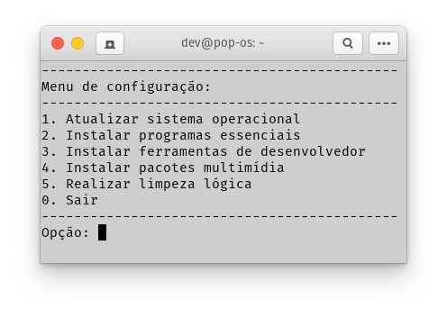
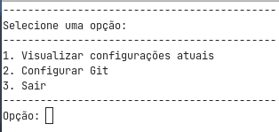

# Scripts Ambiente Linux

## Atualização, configuração e instalação

Automatiza e torna mais rápido a configuração inicial do sistema operacional
(programas e softwares) do linux e do meu ambiente de desenvolvimento/programação
(linguagens de programação e ferramentas).

## Configuração do GIT

Script que permite a visualização e/ou configuração do GIT no sistema operacional.

----
#### *Serve para distribuições Linux baseada em Debian (APT)*
#### *Desenvolvido no Pop!_OS*
