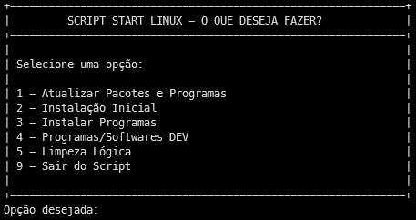
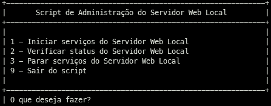

# Scripts Ambiente Linux

## Update, configuração e instalação

Automatiza e torna mais rápido a configuração inicial
(programas e softwares) do linux e do meu ambiente de desenvolvimento/programação
(servidores, linguagens de programação e ferramentas).

## Administração do servidor web local

Automatiza e torna mais rápido execução de comandos via terminal para
iniciar, parar ou verificar o status do servidor web local usando o *systemctl*.

----
#### *Serve para distribuições Linux baseada em Debian (APT)*