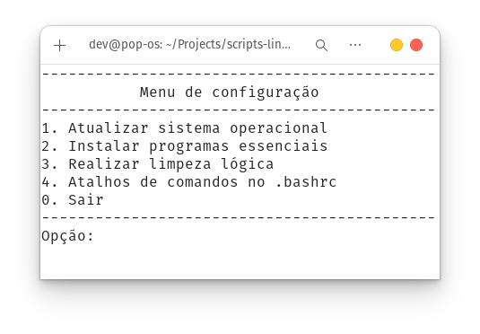
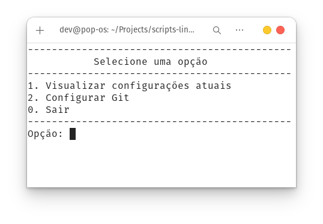

# Scripts Ambiente Linux

## Atualização, configuração e instalação

Automatiza a configuração inicial do Linux que eu uso, baseado em Debian.

## Configuração do GIT

Script que permite a visualização e/ou configuração do GIT no sistema operacional Linux.

----
#### *Serve para distribuições Linux baseada em Debian (APT) - o script 'start_config_version_deb'*
#### *Serve para distribuição Linux Fedora (RPM) - o script 'start_config_version_rpm'*
#### *Desenvolvido no Pop!_OS*
