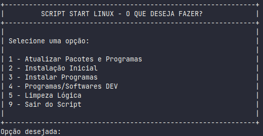

# script-linux

Script criado para tornar mais rápido a configuração inicial, principalmente, do meu ambiente Linux e automatização de algumas tarefas via terminal. 

Serve para outras distribuições Linux baseada em Debian.