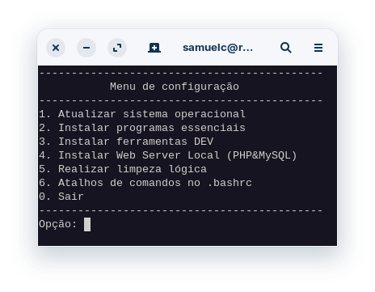

# Scripts Ambiente Linux

## Configuração do GIT

Script que permite a visualização e/ou configuração do GIT no sistema operacional Linux.

## Atualização, configuração e instalação

Automatiza a configuração inicial do Linux que eu uso, baseado em Debian.

Automatiza a configuração inicial do Linux que eu uso, baseado em Fedora.

## Instalação e configuração de um Web Server Local com Apache2&MySQL

----
Desenvolvido por mim 
